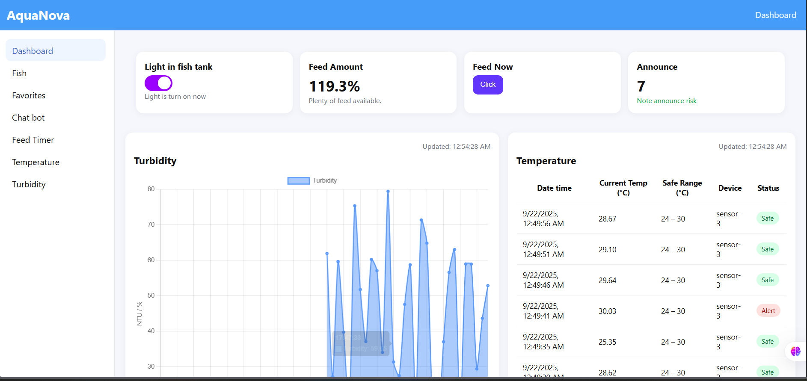

# IoT_AquaNova
IoT project


### Cấu trúc dự án 

```
aquanova/
├─ app.py
├─ config.py
├─ firebase_admin_init.py
├─ serviceAccount.json
├─ requirements.txt
├─ .env                         
├─ blueprints/
│  ├─ telemetry/
│  │   └─ routes.py            
│  ├─ control/
│  │   └─ routes.py            
│  ├─ admin/
│  │   └─ routes.py            
│  └─ dashboard/
│      └─ routes.py            
└─ static/
   ├─ css/
   │   └─ styles.css
   └─ js/
      └─ dashboard.js
└─ templates/
   ├─ index.html                
   └─ admin.html                
   ├─ temperature.html                
   ├─ turbidity.html               
   ├─ feedtimer.html                
└─ mqtt/
   ├─ __init__.html                
   └─ listener.html               
```

Device → MQTT Broker → Flask Subscriber → Firestore → Dashboard