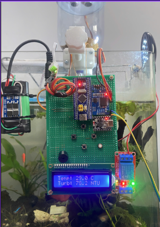

# IoT_AquaNova


### Cấu trúc dự án 

```
aquanova/
├─ app.py
├─ config.py
├─ firebase_admin_init.py
├─ serviceAccount.json
├─ requirements.txt
├─ .env                         
├─ blueprints/
│  ├─ telemetry/
│  │   └─ routes.py            
│  ├─ control/
│  │   └─ routes.py            
│  ├─ admin/
│  │   └─ routes.py            
│  └─ dashboard/
│      └─ routes.py            
└─ static/
   ├─ css/
   │   └─ styles.css
   └─ js/
      └─ dashboard.js
└─ templates/
   ├─ index.html                
   └─ admin.html                
   ├─ temperature.html                
   ├─ turbidity.html               
   ├─ feedtimer.html                
└─ mqtt/
   ├─ __init__.html                
   └─ listener.html               
```
Trang home của web


IP web: aquanova.space


**Phần cứng**

Device → MQTT Broker → Flask Subscriber → Firestore → Dashboard




### Config env 
- Config trên Aws : 
   - Xem log: sudo journalctl -u aquanova --no-pager
   - sudo nano /home/ec2-user/IoT_AquaNova/serviceAccount.json
   - CTRL K 
   - CTRL + O  →  Enter
   - CTRL + X
   - sudo systemctl restart aquanova
   - sudo systemctl status aquanova  (xem activate)
- Config file .env 
   - service_account.json (trên firebase)
   - FIREBASE_CREDENTIALS (path trên máy nếu local)
   - GROQ_API_KEY (tạo trên https://console.groq.com/home)
- Để chạy code tại env 

```
cd env/scripts/activate
cd ..
cd.. 
python app.py
pip install -r requirements.txt
```